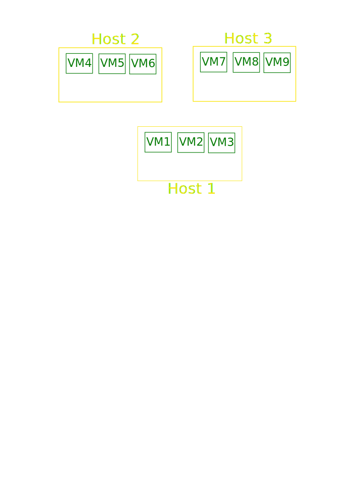
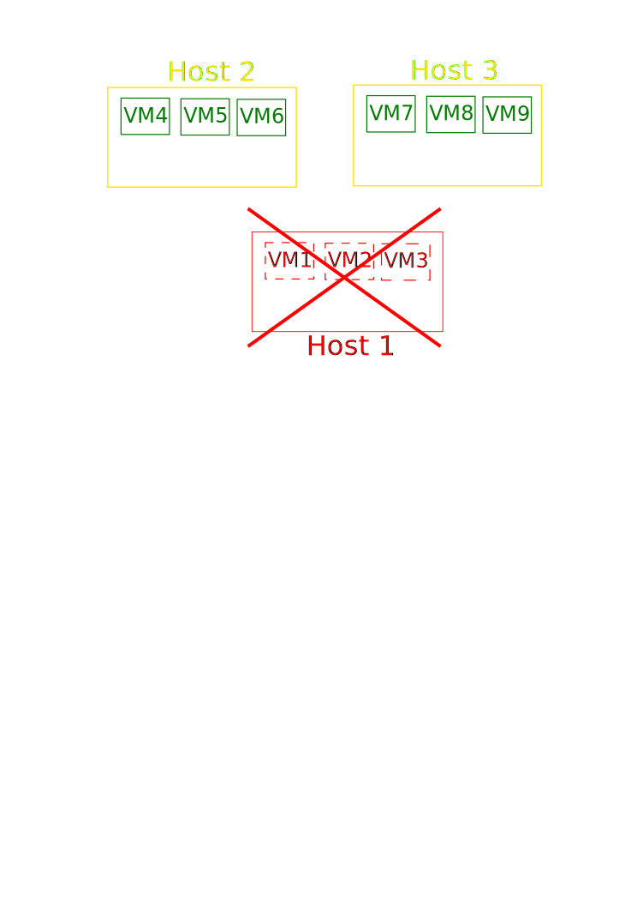
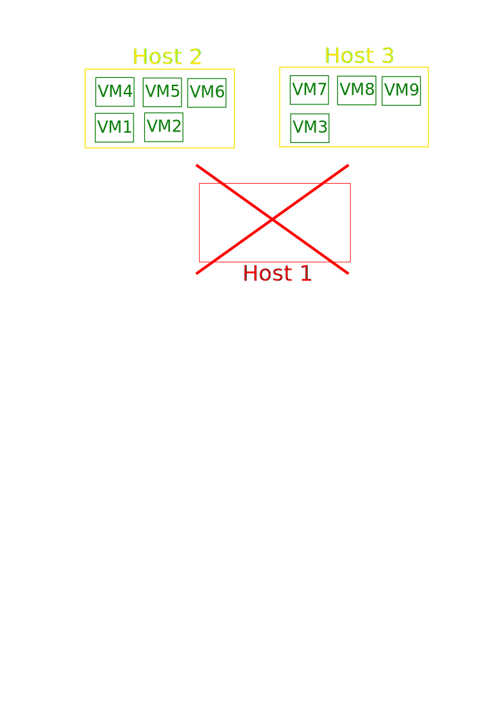
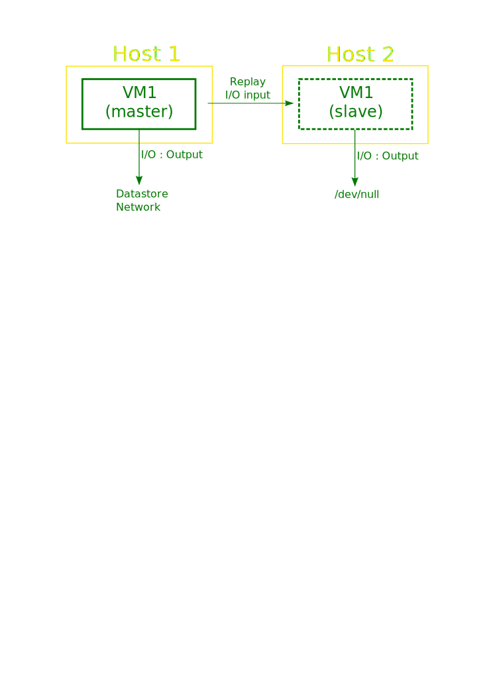
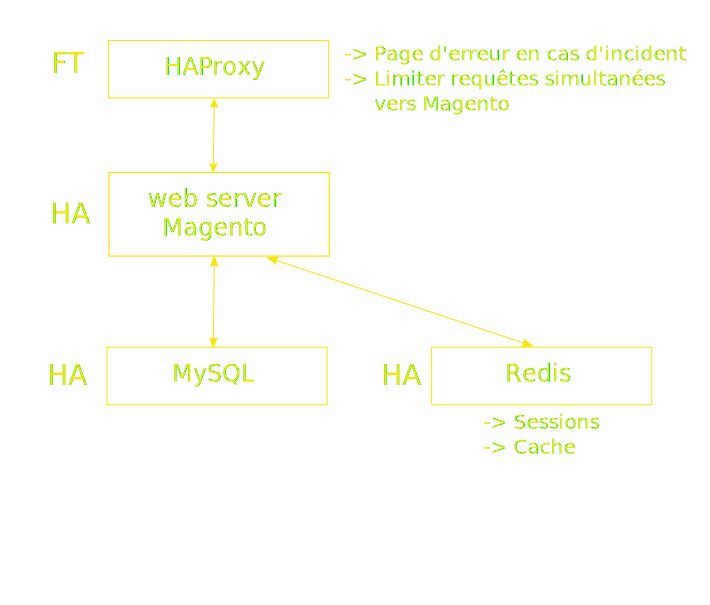

% Private Cloud OVH :\
  Retour d'expérience\
  \
  #APIHour
% [Matthieu Huguet](http://matthieu.huguet.eu/)
  [@madmatah](http://www.twitter.com/madmatah)
% 23 mai 2013

## Un cas client

### 1 site e-commerce (Magento / LAMP)

- ~ 3000 visites / jour
-  Hébergé sur un serveur dédié

### Objectifs de la nouvelle infrastructure

- Évolutive (1 -> N sites e-commerce)
- Disponibilité
- Facile à maintenir
- Rapide à mettre en place

## Private Cloud OVH

-> Nouveau nom : **Dedicated Cloud**

Infrastructure de **cloud dédié** basée sur **VMware vSphere**

\

[http://www.ovh.com/fr/dedicated-cloud/](http://www.ovh.com/fr/dedicated-cloud/)

## Le principe

**Location** d'un ensemble de **ressources** pour constituer votre **infrastructure virtuelle**.

- Host : **RAM**, **CPU**
- Datastore : **stockage**
- Block RIPE : **IPs**

-> Livraison d'une infra vSphere prête à l'emploi

-> Le prix des licences VMware est compris dans le prix de location des serveurs

## Fonctionnalités «de base»

__Créer des VMs__ et leur __allouer des ressources__\
 (RAM, vCPU, espace disque)

## Évolutivité

Possibilité d'ajouter de nouvelles ressources (**Hosts**, **Datastores**) à son infrastructure virtuelle.

__Temporairement__ (facturées à l'heure)

 -> *Encaisser des pics de charges (soldes, pub TV)*

__De façon durable__ (facturées au mois)

 -> *Faire évoluer son infrastructure progressivement*

# vSphere Features

## HA : High Availability

Si une panne est détectée sur une machine physique, toutes les VM présentes sur cette machine sont automatiquement redémarrées et réparties sur vos autres machines physiques.

----

----

----

----

## HA : remarques

Prévoir 30s pour la détection de la panne + le temps de boot de vos VM :\
~2 min d'indispo en cas d'incident

Possibilité de spécifier l'ordre de boot des VM

Possibilité de laisser certaines VM éteintes

## FT : Fault Tolerance

L'état d'une VM est copié en temps réel sur un 2ème host physique.

En cas de panne, bascule automatique sans perte de paquets !

----

## FT : Remarques

VM limitée à un seul vCPU

-> Idéal par exemple pour un load balancer.

## Retour au cas client

### 2 hosts

 - 2x32 Go de RAM
 - 2x 16 core @ 2 Ghz

### 3 datastores

 - 1 To (RAID 10, cache SSD)
 - 2x300Go (RAID 1)

----

## Performances

Passer d'un serveur dédié à un environnement virtuel fait forcément un peu mal...

Mais quel point ?

----

## Requête à une fiche produit

Temps de réponse :

- Avant : 800ms
- Après : 1200ms

**+50%  .... pourquoi ?**

## Performances - CPU

Pour pouvoir fournir des machines avec un grand nombre de cores à prix abordable, OVH a choisi des processeurs **AMD Opteron**.

\

Sur les traitements mono-processus et gourmands en CPU (comme nos requêtes PHP / Magento), on sent la différence.

## Deal with it !

Mise en place de cache un peu plus agressif dans Magento ( [Made_Cache](https://github.com/madepeople/Made_Cache) )

-> 350 ms

 \\o/

## Performances datastores

Les datastores sont des __baies de stockage en réseau.__

*Dans notre cas, pas de baisse de performance constatée.*

## Conclusion

Une solution très satisfaisante pour notre cas.

### Les points forts :

+ Flexibilité
+ Disponibilité
+ Simplicité d'utilisation
+ Features vSphere

### Les points faibles :

- Coût ( ~ 600€ HT / mois)
- Performances

## Merci !

On en parle devant des bières ?

